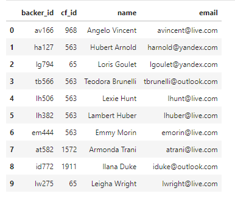
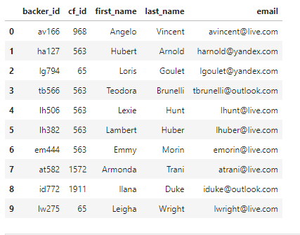
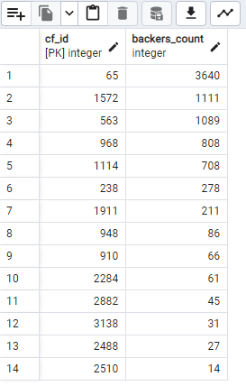
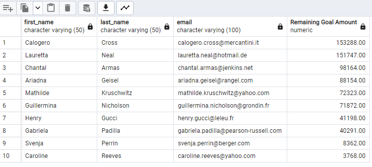
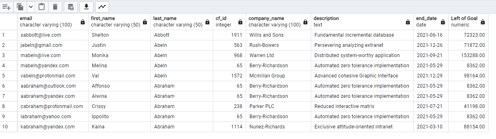

# Crowdfunding-ETL

## **Overview of Crowdfunding-ETL Project**

### Perform an ETL process on the new dataset for backers and data analysis by using SQL queries.

## **Results**

- **Extracted the raw data and added it to a DataFrame for the transform phase.**

  <table>
  <tr>
    <td>Backers DataFrame</td>
  </tr>
  <tr>
    <td></td>
  </tr>
  </table>
  
- **Transformed the data via formatting, splitting, converting data types, and restructuring to create a DataFrame that can be loaded into a PostgreSQL database as a CSV file.**
  
  <table>
  <tr>
    <td>A cleaned DataFrame for PostgreSQL</td>
  </tr>
  <tr>
    <td></td>
  </tr>
   </table>
  
- **Created a backers table with primary and foreign keys based on the summary information about the backers.csv dataset using the ERD created in this module. Exported the updated database schema as a PostgreSQL file and used it to create the backers table in the crowdfunding_db database and uploaded the backers.csv file into the backers table.**
  
  <table>
  <tr>
    <td>The backers table</td>
  </tr>
  <tr>
    <td></td>
  </tr>
  </table>
  
- **Retrieved the number of backer_counts in descending order for each “cf_id” for all the "live" campaigns.**
  
  <table>
  <tr>
    <td>Backer counts for the live campaigns</td>
  </tr>
  <tr>
    <td></td>
  </tr>
  </table>

- **Created a new table named email_contacts_remaining_goal_amount that contained the first name of each contact, the last name, the email address, and the remaining goal amount (as "Remaining Goal Amount") in descending order for each live campaign.**
  
  <table>
  <tr>
    <td>Email_contacts_remaining_goal_amount Table</td>
  </tr>
  <tr>
    <td></td>
  </tr>
  </table>
  
- **Created a new table named email_backers_remaining_goal_amount that contained the email addresses of the backers in descending order, the first and the last name of each backer, the cf_id, the company name, the description, the end date of the campaign, and the remaining amount of the campaign goal as "Left of Goal".**
  
  <table>
  <tr>
    <td>Email_backers_remaining_goal_amount Table</td>
  </tr>
  <tr>
    <td></td>
  </tr>
  </table>
